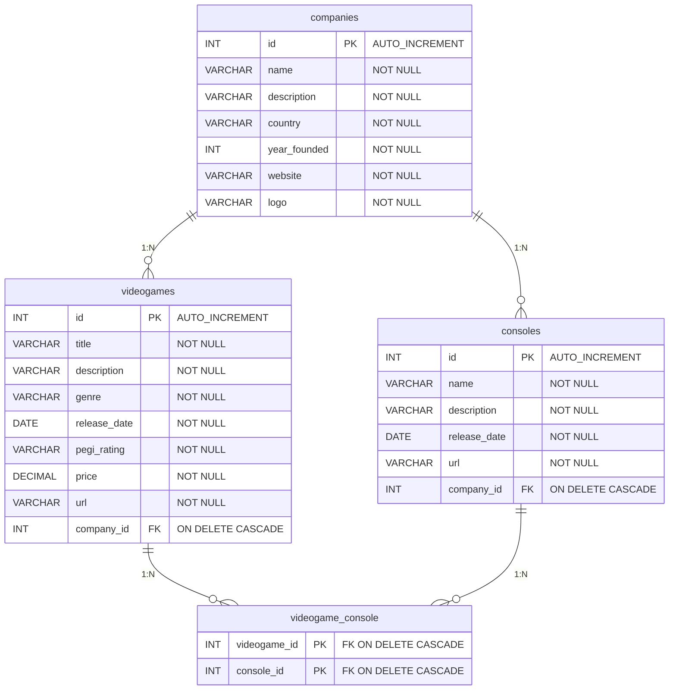

# **Documentación de la Base de Datos (GameNode)**

Esta carpeta define la estructura, inicialización y el modelo de datos del proyecto GameNode. El motor de base de datos utilizado es **MariaDB**.

## 📊 Modelo Relacional 

A continuación se detalla el esquema físico de la base de datos. Este diagrama refleja exactamente las tablas, columnas, tipos de datos y relaciones (PK/FK) implementadas en el código:

## 📖 Diccionario de Datos

| Tabla | Descripción | Relaciones Clave |
| :--- | :--- | :--- |
| **`companies`** | Almacena las empresas desarrolladoras de software y fabricantes de hardware. Es la tabla principal del dominio. | Padre de `videogames` y `consoles`. |
| **`videogames`** | Catálogo de software. Almacena metadatos del juego y su precio. | FK `company_id` apunta a `companies`. |
| **`consoles`** | Catálogo de hardware. Almacena las plataformas de juego disponibles. | FK `company_id` apunta a `companies`. |
| **`videogame_console`** | Tabla pivot (intermedia). Resuelve la relación de **Muchos a Muchos (N:M)**. Un juego puede salir en múltiples consolas, y una consola reproduce múltiples juegos. | PK compuesta por ambas FKs. |

> ⚠️ **Nota sobre la Integridad Referencial:** Todas las claves foráneas (FK) están configuradas con `ON DELETE CASCADE`. Esto significa que si se elimina una empresa, se borrarán automáticamente todos sus juegos y consolas asociadas, limpiando también la tabla intermedia sin necesidad de lógica extra en el backend.

## 🛠️ Scripts de Inicialización

* **`init.sql`**: Script idempotente (`IF NOT EXISTS`) que se ejecuta automáticamente al levantar el contenedor de Docker por primera vez. Se encarga de:
    1. Crear la base de datos `gamenode`.
    2. Levantar la estructura de tablas.
    3. Inyectar datos semilla (*seeding*) para tener un entorno local funcional desde el primer minuto.